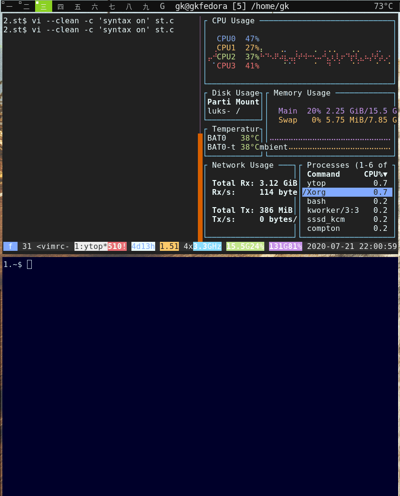
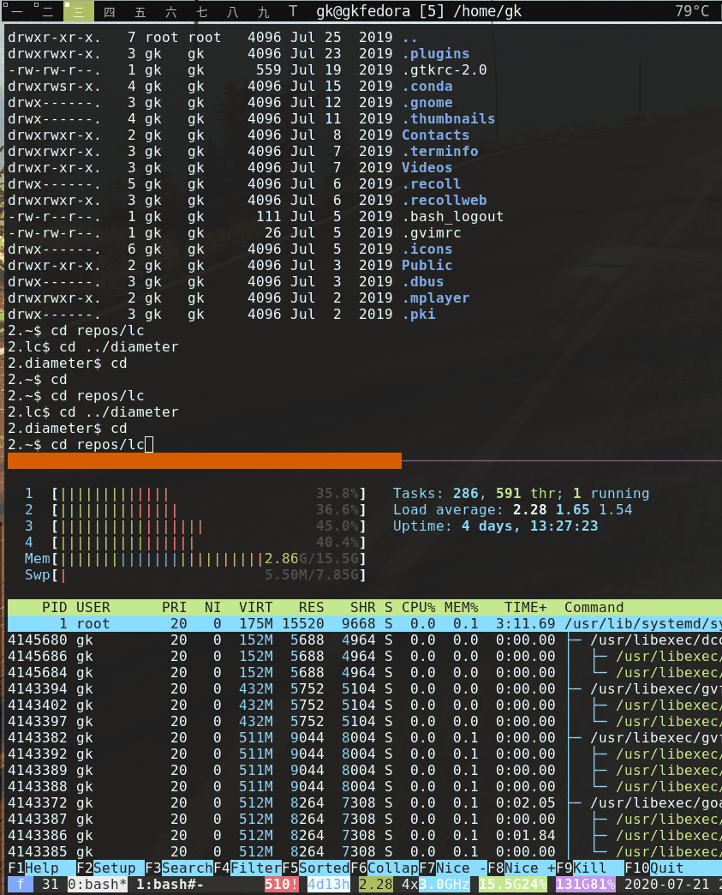

# Suckless Add Ons

## Dynamic Terminal Colors

Allows [st](https://st.suckless.org/) to read color and alpha definitions for the 16 base colors from a file, after receiving a signal.

At reload we try to

1. Read `/tmp/st/$WINDOWID/xrdb` if `/tmp/st/$WINDOWID/pid` is present and matches st's current PID.
1. On error read `/tmp/st/xrdb` (i.e. current defaults).
1. On error read (xrdb-loaded) `$HOME/.Xresources` (that’s what the [st-xresources patch](https://st.suckless.org/patches/xresources/) does).
1. On error give up.

<details><summary>File Format</summary>

```
2.$ cd /tmp/st # default one, others in /tmp/st/<windowid>/xrdb
2.st$ cat xrdb
! Base16 Rebecca
! Scheme: Victor Borja (http://github.com/vic) based on Rebecca Theme (http://github.com/vic/rebecca-theme)

*foreground:   #f1eff8
#ifdef background_opacity
*background:   [background_opacity]#292a44
#else
*background:   #292a44
#endif
*cursorColor:  #f1eff8

*color0:       #292a44
*color1:       #a0a0c5
*color2:       #6dfedf
*color3:       #ae81ff
*color4:       #2de0a7
*color5:       #7aa5ff
*color6:       #8eaee0
*color7:       #f1eff8

*color8:       #666699
*color9:       #a0a0c5
*color10:      #6dfedf
*color11:      #ae81ff
*color12:      #2de0a7
*color13:      #7aa5ff
*color14:      #8eaee0
*color15:      #53495d

! Note: colors beyond 15 might not be loaded (e.g., xterm, urxvt),
! use 'shell' template to set these if necessary
*color16:      #efe4a1
*color17:      #ff79c6
*color18:      #663399
*color19:      #383a62
*color20:      #a0a0c5
*color21:      #ccccff
*alpha: 0.9

```

</details>

You can pull many themes from the base16 repo and have them rendered into .Xresources files.


## Theme Picker

[Here](./theme-reloading/st_theme) is a theme picker, based on fzf:



1. It opens on hotkey (default alt-enter) in another X window.
1. Since this works more low level than `tput` commands, it also affects vim
   directly as you can see. Personally I still prefer to use colorschemes, though.
1. Can also set a theme into a given window w/o directly

The latter feature allows e.g. coloring based on directory entered, via an
overload of `cd`, e.g.: 

```bash
function set_theme {
    # walk up the tree, trying to load a directory theme:
    local d="${1:-"$(pwd)"}"
    test "$d" == "/" && return
    test -e "$d/.terminal_theme" || { set_theme "$(dirname "$d")"; return; }
    st_theme -t "$(xargs < "$d"/.terminal_theme  | sed -e 's/base16://g')"
}

function cd {
    builtin cd "$@"
    [[ -t 1 ]] && set_theme
}

export -f cd set_theme

```


The theme picker offers to write the current theme into the current directory
via an hotkey (see help header).

For differently colored remote hosts, you can easily do something similar in
an ssh-wrapper.

## Ideas

1. Why not dynamically change the Red-ness of a window based on CPU burnt within it? 
1. Send a custom ANSI-Escape sequence with the theme name to stdout, so that
   javascript based terminal emulators can re-apply matching stylesheets, when
   playing back recordings done in st.
1. Work off the shelve also with other theme suppliers. st is true color, i.e.
   also the universe of CSS themes is 1:1 useable

Not yet implemented but maybe one day. If you have other ideas let me know, via a github issue.


### Installation

#### Update ST

The [suckless way](https://www.youtube.com/watch?v=3C6saSpX4KQ).

Here an install against st 0.8.4:

First we apply the st-xresources patch, then
[this](./theme-reloading/st-theme-reloading-20200721.diff) one.

```bash
git clone -q https://git.suckless.org/st
cd st
git rev-parse HEAD
# fa253f077f19b3220c7655b81bd91e52f4367803
wget -q https://st.suckless.org/patches/xresources/st-xresources-20200604-9ba7ecf.diff
patch -p1 < st-xresources-20200604-9ba7ecf.diff 
# patching file config.def.h
# patching file x.c
patch -p1 < st-theme-reloading-20200721.diff
# patching file config.def.h
# patching file st.c
# patching file st.h
# patching file x.c
make
./st -v
# ./st 0.8.4
```

Short test:

Once started, find the PID of it and send a kill -1 (HUP) to it. It should survive the reload and NOT hangup any longer.

For alpha you need also the [alpha](https://st.suckless.org/patches/alpha/) patch and a running compositor.

#### Theme Picker

1. Install [fzf](https://github.com/junegunn/fzf)
1. Make [this file](./theme-reloading/st_theme) available in your `$PATH` - it
   will be called at hotkey `alt-return` (change in `config.def.h`)
1. In e.g. your `.bashrc` export `$THEMES_DIR`, pointing to where all your
   themes are:

```bash
2.~$ cd $THEMES_DIR
2.xresources$ ls
base16-3024-256.Xresources
base16-gruvbox-light-hard-256.Xresources
(...)
```


### Addendum

- In the patch we provide also a simple background color changer, usefull e.g. for many editor windows with their own colorschemes
- The C code sucks *not* less, I'm a noob for C.
- gifs recorded with `byzanz-record --duration=20 -x 1150 -y 1439 -w 843 -h 1044 <filename>.gif`
