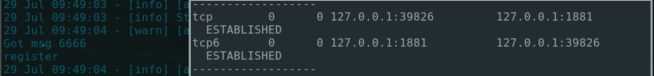
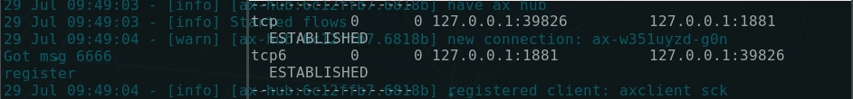
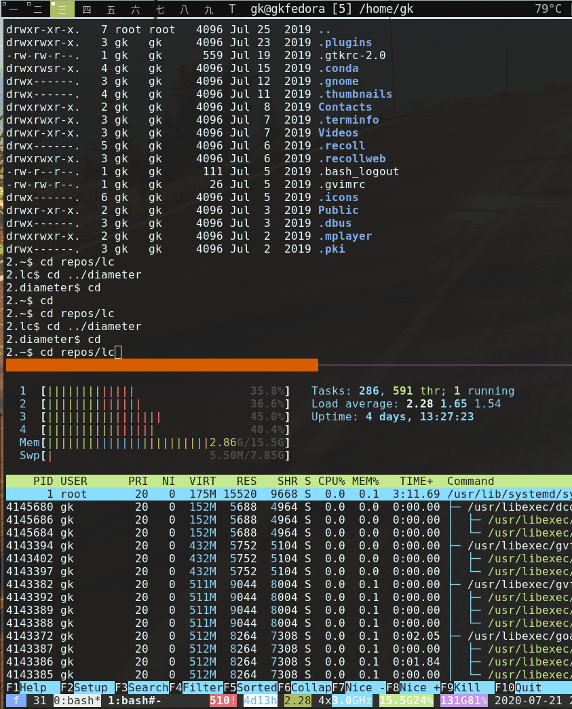

---

author: gk
version: 20200728

---

# Suckless Add Ons

<a href="https://travis-ci.org/github/axiros/suckless-add-ons"></a>

## Dynamic Terminal Colors

Allows [st](https://st.suckless.org/) to read color and alpha definitions from a file, after receiving a signal.

Per default we support dynamic changes of all variables defined in the [st-xresources patch](https://st.suckless.org/patches/xresources/), including the [16 base colors](http://chriskempson.com/projects/base16/).

At reload we try to

1. Read `/tmp/st/$WINDOWID/xrdb` if `/tmp/st/$WINDOWID/pid` is present and matches st's current PID.
1. On error read `$HOME/.config/st_theme/default_config` (i.e. current defaults).
1. On error use the `Xresources` definitions, which X11 windows get (once) from the X server at creation (that’s what the [st-xresources patch](https://st.suckless.org/patches/xresources/) does). Changes here require to reload them into the X server via `xrdb <-load|-merge>`.
1. On error give up.


## Theme Picker

[Here](./theme-reloading/st_theme) is a theme picker, based on fzf:


Sorry for the flickering - we try to show that it is pretty fast, applying the themes.

1. It opens on hotkey (default alt-enter) in another X window. If you prefer to have it
   floating, then set a window class within the launch command, in `st.c`
1. Since this works more low level than `tput` commands, it also affects vim
   directly as you can see. Personally I still prefer to use dedicatd vim colorschemes,
   though - this does not collide with setting the 16 base colors.
1. Can also set a theme into a given window directly, w/o fzf

```bash
st_theme set [-t <theme name>] [-a <relative alpha change>] [-c <custom attr, e.g. alpha=0.3>]
```

### Instant Alpha Changes

When you enter a (float) number into the fzf query then st_theme will
interpret it as alpha value and instantly applies the value. On enter you get
back into color selection mode. On escape in alpha mode we exit fzf.

This allows to quickly set e.g. a dwm-floating window over another into
transparent mode, i.e. to get from this:




to this:



via `ALT-ENTER->0->ESC` (with alt enter the default for starting the selector)

If you do this more often you might want to bind hotkeys to

```bash
st_theme set -c alpha=<0|1> [-w <windowid>]
```

### Directory Themes

The "direct apply" feature allows coloring based on directory entered, via an overload of `cd`, e.g.: 

```bash
# simply trying find .terminal_theme files in directories:
function set_theme {
    # walk up the tree, trying to load a directory theme:
    local d="${1:-"$(pwd)"}"
    test "$d" == "/" && return
    test -e "$d/.terminal_theme" || { set_theme "$(dirname "$d")"; return; }
    st_theme set -f -t "$(xargs < "$d"/.terminal_theme  | sed -e 's/base16://g')"
}

function cd {
    builtin cd "$@"
    [[ -t 1 ]] && set_theme
}

export -f cd set_theme

```



A more complex version of `set_theme`, which keeps the directories in a file (`.config/st_theme/directory_themes`), is
provided [here](./theme-reloading/set_theme_on_cd) - On hotkey `D` the theme
picker writes that file.

---

- For differently colored remote hosts, you can easily do something similar in an ssh-wrapper.

## Ideas


1. Dynamically change the Red-ness of a window based on CPU currently burnt within it? 
1. Send a custom ANSI-Escape sequence with the theme name to stdout, so that
   javascript based terminal emulators can re-apply matching stylesheets, when
   playing back recordings done in st.
1. Work off the shelve also with other theme suppliers. st is true color, i.e.
   also the universe of CSS themes is 1:1 useable

Not yet implemented but maybe one day. If you have other ideas let me know, via a github issue.


## Installation

### Update ST

The [suckless way](https://www.youtube.com/watch?v=3C6saSpX4KQ).

Here an install against st 0.8.4:

First we apply the st-xresources patch, then
[this](./theme-reloading/st-theme-reloading-20200721.diff) one.

```bash
git clone -q https://git.suckless.org/st
cd st
git rev-parse HEAD
# fa253f077f19b3220c7655b81bd91e52f4367803
wget -q https://st.suckless.org/patches/xresources/st-xresources-20200604-9ba7ecf.diff
patch -p1 < st-xresources-20200604-9ba7ecf.diff 
# patching file config.def.h
# patching file x.c
patch -p1 < st-theme-reloading-20200721.diff
# patching file config.def.h
# patching file st.c
# patching file st.h
# patching file x.c
make
./st -v
# ./st 0.8.4
```

Short test:

Once started, find the PID of it and send a kill -1 (HUP) to it. It should survive the reload and NOT hangup any longer.

For alpha you need also the [alpha](https://st.suckless.org/patches/alpha/) patch and a running compositor.


### Theme Picker Install

1. Have a python executable in your $PATH
1. Install [fzf](https://github.com/junegunn/fzf)
1. Make [st_theme](./theme-reloading/st_theme) available in your `$PATH` - it
   will be called at hotkey `alt-return` (change in `config.def.h`)

Optional: xdotool, [dunstify](https://dunst-project.org/)

- `st_theme` invokes `xdotool` to quickly activate the window at fzf-select, otherwise X does
not always redraw them when you hover over the available themes too quickly.
We also use `xdotool` to select other windows a certain theme should be
applied at. `xprop` would be an alternative.
- Also it sometimes invokes notify-send or dunstify, for some notifications.
- For a special feature, directory based themes, it requires to have the directory st is
  currently in, from the fzf window.
  This is tricky, when `st_theme` is launched via a hotkey and not by just
  typing `st_theme` into the terminal. `st_theme` tries to call a script
  `wininfos` and passes the windowid of st. I have such a script but it is
  pretty custom.
  When `wininfos` is not available `st_theme` writes the theme for the directory
  where it was launched. 


-> Remove or replace with your tools if you don't want/have the optionals.

#### Theme Picker Config

Happens in "$HOME/.config/st_theme". The files there are all created and changed automatically when using `st_theme`, except: 

- `config.sh/filter`


We have

##### `config.sh`

Parametrizes st_theme itself, in shell soureable format. Read at startup of st_theme. Contains:

- ST_THEMES_DIR [mandatory]: Directory of all available themes (entered automatically after `b16convert`, see below)
- filter [optional]: Blacklist of themes at startup of the theme selector (`F` toggles). Manually entered.
  Example (for dark theme addicts): `filter='light|github|dirtysea|tomorrow  |shapeshifter|brush trees  |cupertino|cupcake|soda  '`
 
##### `default_config`

Written at Enter key at the theme selector, together with a resulting Xresources file which is loaded into X server.

Contains:

- theme: name of theme
- alpha: transparency value (1: opaque)
- [value overwrites], e.g. `background=#444`

##### `xrdb_template`

Maps base16 key/values into st color values and alpha. Defines the managed set
of colors. Usually not touch, created at first start of st_theme.


### Pulling Themes

The Theme Picker has some functions to pull and convert all base16 themes:

```bash
1.inst$ mkdir st_theme
1.inst$ cd st_theme/
1.st_theme$ st_theme -h
Theme Selector For Suckless Terminal (st)

USAGE: st_theme [action] [switches]

ACTIONS (default: start fzf selector):

show_inline_Shows a little in-terminal selector
b16fetch    Downloads all base16 schemes from the master list
b16convert  Converts fetched base16 scheme yaml files into xrdb files and sets \$ST_THEMES_DIR accordingly.
list        Show all themes, colored, sorted by contrast
set         Set/change a theme directly
select      Start fzf theme selector
transfer    Transfers config to other window

Default action: Start fzf selector on windowid given via switch -w
st_theme <action name> -h: Detailed help on actions.

1.st_theme$ st_theme b16fetch
Cloning into 'base16'...
Fetching atelier
(...)

# now we convert them to st_theme format:
1.st_theme$ st_theme b16convert
Eva                            | eva                            | 0.59,59.50,-0.30|(...)
(...)
Converted 159 themes into /home/gk/inst/st_theme/base16/output/st_theme/index
Adding ST_THEMES_DIR=/home/gk/inst/st_theme/base16/output/st_theme to /home/gk/.config/st_theme/config.sh. Ok?
y # say yes here

# show them all:
1.st_theme$ st_theme list -P
```

### Instructing X Server to Load Current Default Theme At Startup

The theme picker, when you exit with enter writes (and loads) `$HOME/.config/st_theme/Xresources` based on current choice of theme and alpha, so that new windows get themes accordingly.

This is how you make it load that files at startup, e.g. in your .xinitrc:

```bash
load_xresources () {
    # complete setup for st, thanks to the Xresources patch:
    xrdb $HOME/.Xresources
    xrdb -load $HOME/.config/st_theme/Xresources
}
```

## Security

We source and bash-eval a lot the contents of config files -> do not create them based
on unverified user input.


## Running as sudo -root

When (sudo root) should be able to use e.g. the Theme Picker or see directory
themes we need to 

- export `$WINDOWID` over, e.g. via something like `alias sudo='/usr/bin/sudo --preserve-env=WINDOWID'`
- make sure permissions of written temp and config files keep assigned to normal user.

User perms change on sudo root - Window IDs remain, so we have to keep them writable.

=> Put this into root's profile, thats prbly. the most simple way:

```bash
function st_theme () {
    local cfg d u="$SUDO_USER"
    test -z "$u" && return
    cfg="/home/$u/.config/st_theme"
    /usr/local/bin/st_theme -D "$cfg" "$@"
    for d in /tmp/st /home/$u/.config/st_theme; do chown -R "$u:$u" "$d"; done
}
export -f st_theme
```

It should be clear that what was said regarding security and evals is yet more critical in sudo-root mode of operation. 


### Addendum

- In the patch we provide also a simple background color changer, usefull e.g. for many editor windows with their own colorschemes
- The C code sucks *not* less, I'm a noob for C.
- gifs recorded with `byzanz-record --duration=20 -x 1150 -y 1439 -w 843 -h 1044 <filename>.gif`
